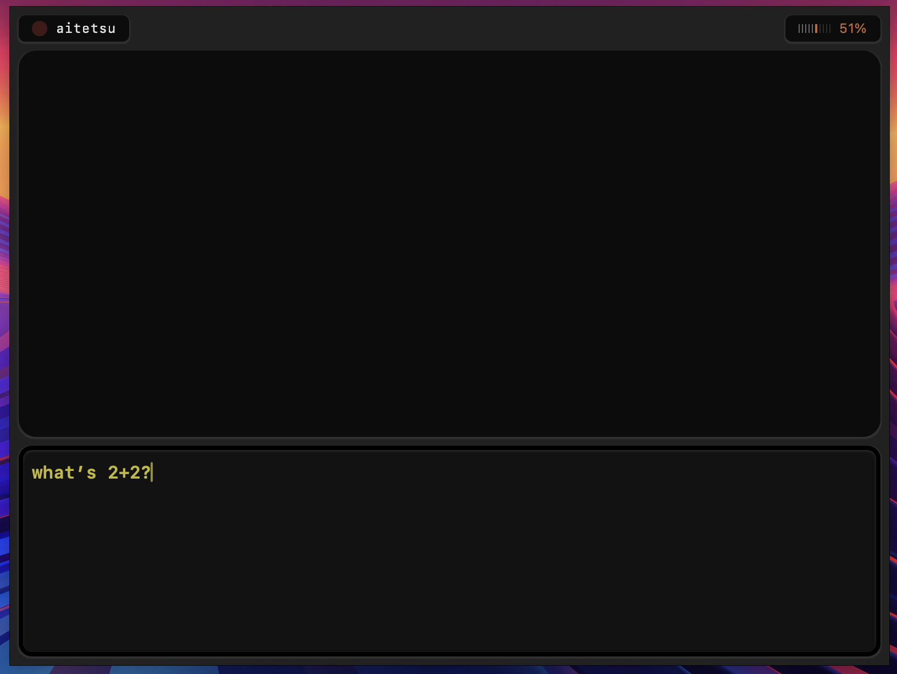
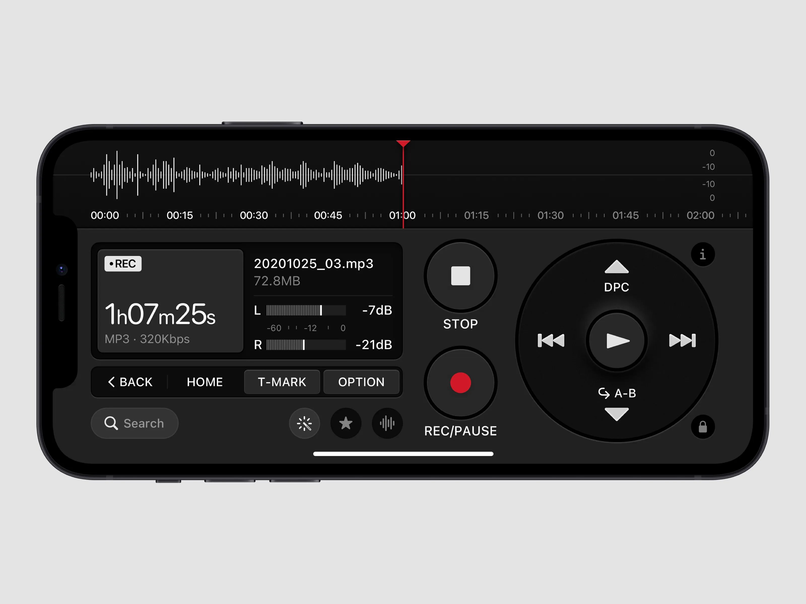

## AI agent

### Demo

### Notes

- This was supposed to be a GUI AI agent
- Heavily inspired by a post on X (couldn't find it, see lower)

### RE-DESIGN NOTES

- [ ] Try to get feedback U.S. Graphics Company
- [ ] Have timeline just like that recorder app design.

Basically, worse version of "Claude Code", "Codex", "OpenCode" but it is mine!

### TODO

- [ ] event handling is not reliable. if model immediately does tool calling i see empty message and then post-tool message
- [ ] add `check_aws_lamda_logs` tool that can check CloudWatch logs of Lambda functions (for work)

### Brainstorming

**Saving tokens**:

- Have "Plan" mode like Cline, where files have comments and blank lines stripped
  - Stripping comments and blank lines doesn't seem effective most of the time and saves only few tokens
- Reasons from putting whole file contents:
  - Edit diffs - IMPORTANT, REQUIRED
  - Follow style - What if I analyze codebase and generate bunch of rules instead,
    then I extract only relevant nodes from AST for the code that needs modifying and send those blocks to LLM
  - On the other hand, relying AST doesn't seem useful when LLM needs to add a new node unrelated to the relevant nodes (e.g. create a constant at the top of the file)

Inspired by following design I saw on X:

